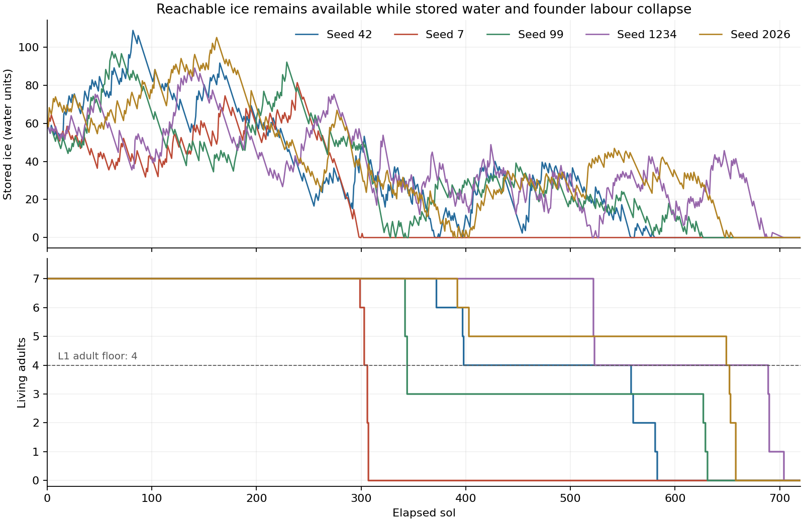

# Ice supply investigation — 2026-10-09

**The colonies run out of delivered water while ice remains in reachable fields.** The measured failure is insufficient collection throughput by seven founders, made worse by delayed mining plans, low-energy departures, partial returns, and a growing dependant population. This investigation does not identify a single safe tuning change: it records the mechanism and hands the response to the game designer/owner. No game mechanics or data were changed.

## Scope and verification

Baseline merge [PR #3](https://github.com/HerbyJ3/eco-game-idea/pull/3) is on main at `fd7f76a`. This diagnostic starts from that game with shipped data hash `c370381b5ad96932`. The [Standard baseline](lifecycle-standard-baseline.md) already establishes extinction on all five seeds.

Ran each seed for 720 sols with a new read-only [ice-supply probe](../../tools/ice_supply_probe.gd), then again with observation disabled. That horizon covers every first drought and extinction without extending the empty simulation to 1,500 sols. Every trace/control pair has identical end-state **and RNG-state** digests. All 721 population and ice samples match the corresponding Standard baseline exactly. Additional snapshot runs on 7 and 2026 match their controls too. All twelve jobs exit 0; no script errors. Per-step stock accounting closes to less than `1e-8` (observed maximum zero).

Commands, actual exit codes and timings: [manifest](ice-supply-investigation-data/manifest.json). Raw [data directory](ice-supply-investigation-data/), [summary JSON](ice-supply-investigation-data/summary.json), [summary CSV](ice-supply-investigation-data/summary.csv), and [chart](ice-supply-investigation-data/ice-and-founders.png). Controls verify instrumentation neutrality, not successful survival.

```bash
godot --headless --path station-zero --script res://tools/ice_supply_probe.gd -- --seed 7 --sols 720 --out station-zero/docs/balance/ice-supply-investigation-data
godot --headless --path station-zero --script res://tools/ice_supply_probe.gd -- --seed 7 --sols 720 --out station-zero/docs/balance/ice-supply-investigation-data --control
# Optional checkpoint snapshots (use a separate output directory):
godot --headless --path station-zero --script res://tools/ice_supply_probe.gd -- --seed 7 --sols 720 --out /tmp/ice-snapshots --snapshots 270,280,286,298,300
```

## What the five seeds show

| Seed | First dry event sol | Reachable field ice at start of that sol | Ice departures | Exhausted departures | Median plan→launch hours | Median launch energy | Mean delivered load |
|---|---:|---:|---:|---:|---:|---:|---:|
| 42 | 370 | 356.40 | 215 | 45 (20.9%) | 53.80 | 64.71 | 5.047 |
| 7 | 298 | 440.85 | 101 | 46 (45.5%) | 121.45 | 40.39 | 4.629 |
| 99 | 327 | 87.51 | 209 | 46 (22.0%) | 79.85 | 49.62 | 4.850 |
| 1234 | 520 | 124.21 | 314 | 91 (29.0%) | 66.98 | 53.83 | 5.015 |
| 2026 | 388 | 693.33 | 254 | 115 (45.3%) | 41.75 | 46.78 | 4.597 |

The field quantity is a start-of-sol measurement, not a minimum across the sol. The stock first dries **during** the listed sol; the baseline’s first zero sample can be later or can miss a short dry interval. Two fields are reachable at every recorded boundary. Seed 7’s exact checkpoint at the start of sol 298 contains 116.85 and 324.00 field units (440.85 total), with 0.29 stored units remaining; it runs dry later that sol. These data rule out “no reachable ice” as the first-crisis explanation.

Mean load excludes empty returns and deaths. Empty ice returns are 6/0/2/13/15 on seeds 42/7/99/1234/2026; seed 2026 also has one death on an ice trip. Seed 7 delivers every ice load, so missing deposits or lost cargo cannot explain its first collapse. The stock accounting independently confirms each measured deposit.



## Seed 7: delivery falls as the first babies arrive

| Sol interval | Ice delivered per sol | Actual ice consumed per sol | Ice departures | Exhausted departures |
|---|---:|---:|---:|---:|
| 0–99 | 1.550 | 1.726 | 34 | 12 |
| 100–199 | 1.888 | 1.726 | 40 | 19 |
| 200–279 | 1.382 | 1.726 | 23 | 11 |
| 280–299 | 0.474 | 2.026 | 4 | 4 |

Consumption is the water actually removed from storage, clamped at zero; once dry, it **understates unmet demand**. Seven beings need 1.726 units/sol; twelve need 2.959, a 71.4% increase at the unchanged `0.01` units/being/hour. There are still only seven adults. The ice target stays at 120 for both populations because `ice_min` dominates `8 × pop`; the target alone does not reserve a delivery rate for the incoming babies.

First birth is sol 286. Four ice trips depart during sols 280–299, and all turn back exhausted. Their plan-to-launch waits are 356.65–580.90 hours (14.46–23.56 sols), with starting energies 25.95–39.34. One arrives with a refill during sol 300, after deaths have begun. At the start of sol 298, five of the seven founders still carry ice plans; several are sleeping or travelling rather than collecting. The trace shows interrupted plans, not a refusal to mine.

Seed 7’s ice-trip plan-to-launch median is 121.45 hours (4.93 sols), versus 11.27 hours of physical corridor walking from habitat #2 to launch #10 in the checkpoint graph. The median is for all completed launches, including direct launches with zero route time; it includes intervening pauses, sleep, other jobs, and any retargeting. It is not a pure pathfinding travel time.

Across seeds, 37.0–42.2% of all founder-hours are awake while carrying a mining intent. Those categories include idle waits, travel, and interruptions by other jobs; they are **not** exclusive mining-work hours. Sleep occupies about 10.6–11.0%. This observation points to plan execution and commute overhead as a diagnostic priority, without proving which change would improve survival.

## Code paths behind the observed bottleneck

1. **Reachability measures EVA, not the whole commute.** `Resources.launch_for` picks the online door nearest the field. `trip_time` checks the round trip from that door against the suit filter. Neither includes the founder’s corridor journey to that launch. On seed 7, both available ice fields use launch #10 at the first crisis; the habitat-to-launch route has four corridor hops. [Resources](../../sim/resources.gd).
2. **Every room arrival introduces another wait.** `Being.enter` applies `idle_wait` after a corridor hop; `decide` can choose sleep or construction before resuming the mining intent. Repeated door walks, room pauses, sleep trips and other jobs separate planning from departure. This is the current specified ordering, not a newly introduced routing bug. [Being](../../sim/being.gd).
3. **Launching does not recheck the energy needed for the job.** The sleep threshold is checked at the earlier decision. Walking to the door continues draining energy; `_suit_up_miner` then fills air and leaves without a fresh energy gate or round-trip energy forecast. Low-energy departures and partial returns appear directly in the trip records. Non-exhausted delivered ice loads average 5.15–5.51 units across seeds; exhausted delivered loads average 3.48–3.75.
4. **Urgent water affects new plans, not existing ones.** `choose_site` forces ice below 30 units, but `_resume_mine_intent` runs first and can continue a previously selected regolith plan. While storage is below 30, the trace still observes 251.45/77.90/432.60/510.60 founder-hours tagged to active pit jobs on seeds 42/99/1234/2026; seed 7 has none. That is a contributing behaviour on some seeds, not the sole explanation. [Site selection](../../sim/world.gd).
5. **Dependants consume immediately; replacement labour arrives eighteen years later.** All life stages currently use the same per-being water consumption. When shortages kill founders, collection capacity shrinks and no young colonist can replace it. The existing thirst timer then repeatedly selects victims. [Colony](../../sim/colony.gd) and [lifecycle](../specs/lifecycle.md).

These observations support a throughput failure and identify its interacting paths. Their relative causal contributions have not been isolated with parameter experiments. No consumption, yield, travel, sleep, construction priority, birth rule, or starting layout was tuned in this investigation.

## Seed 2026 power outage

Green room #15 shorts during sol 278 and comes back during sol 288, after 254.35 hours (the baseline rounds this to 254.4). With three reactors, supply is 42; total demand becomes 43 when another construction site is active. Turning off the 4-draw room leaves 39 draw. The re-online rule requires `39 + 4 <= 0.95 × 42 = 39.9`, so the room cannot return even after the short hold expires. Completion of the fourth reactor increases supply to 56; re-online then succeeds. Checkpoint snapshots and daily supply/demand confirm this sequence. [Power rules](../../sim/buildings.gd).

This is a reserve-margin and reactor-completion delay, rather than a recurring short or missing re-online call. Ice first dries during sol 388, roughly 100 sols after power returns; the other four seeds have no short at all. The outage fails T5 separately and does not account for the shared extinction mechanism.

## Handoff and next task

Investigation complete. The next task is a game-designer/owner specification for sustainable founder-era water collection, informed by the commute/energy/plan trace and the dependant burden, plus a separate decision about the power reserve target. Only after that specification should a gameplay fix or one-parameter experiment be made. Any experiment should declare its acceptance rule beforehand, compare all five seeds at Standard, preserve the calendar/clock and late Council rule, and guard founder survival, ice delivery, power, birth reservations and stage counts. Final Standard repeat and Generational adulthood verification remain pending.

The Settlement adjustment trigger remains unmet (four seeds enter on schedule). Emotions, detailed animations, and artwork integration remain pending. Existing twelve interior concepts and references are available; the owner’s additional large images can be reviewed when accessible. The owner’s new default usage rule is recorded in HANDOFF: at 95%, finish the current task, update/merge, and stop without starting the next task.
